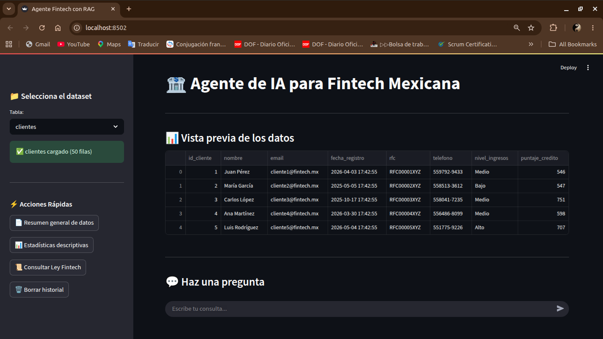
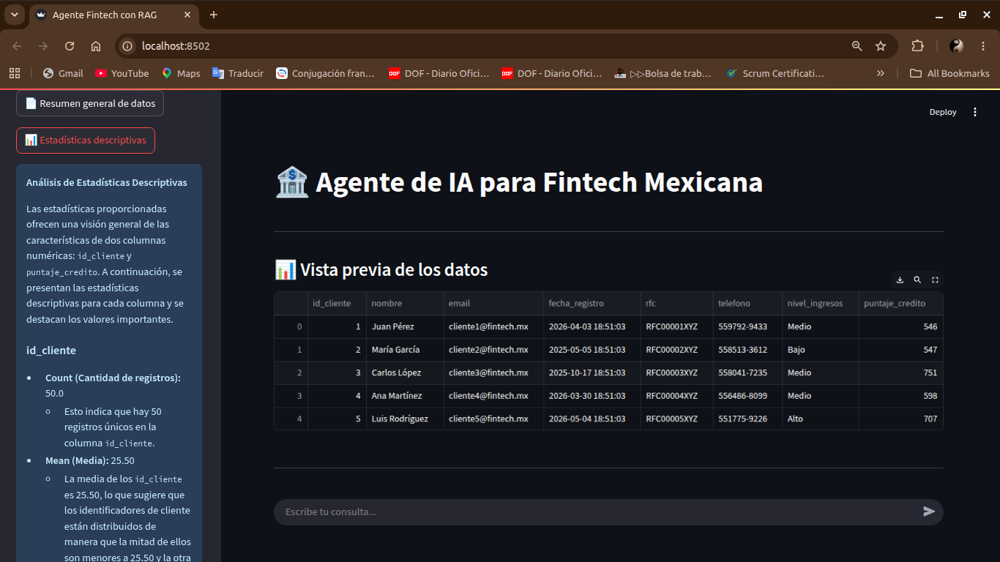
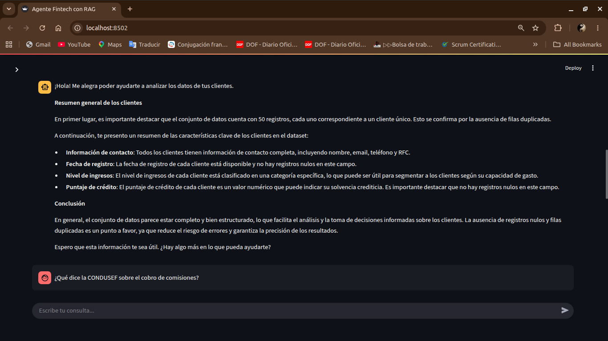
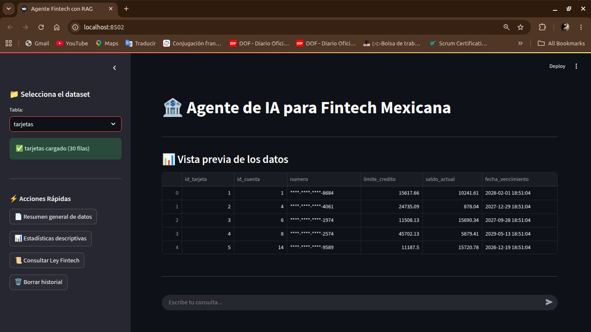
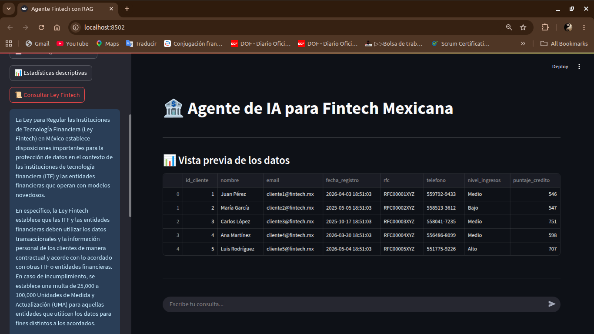
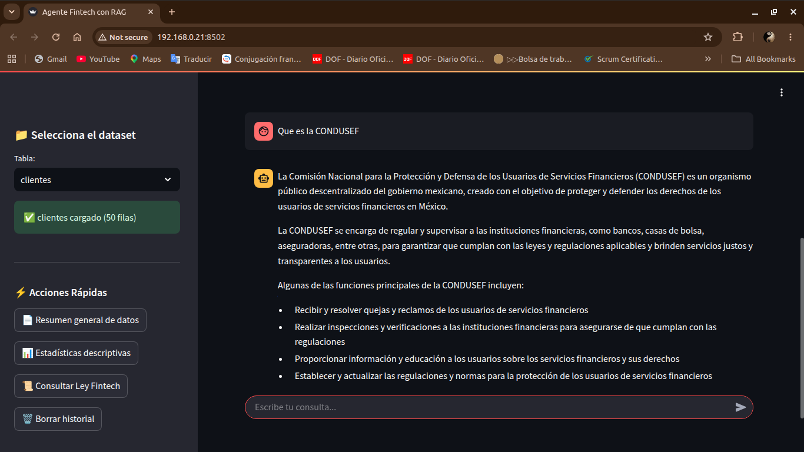

# 🤖 Agente de IA para Fintech Mexicana

**Un asistente conversacional inteligente especializado en el sector financiero mexicano, que combina análisis de datos sintéticos, búsqueda en documentos legales (RAG) y razonamiento autónomo.**

---

## 📌 Tabla de Contenidos

- [Características principales](#-características-principales)
- [Arquitectura y Tecnologías](#-arquitectura-y-tecnologías)
- [Requisitos previos](#-requisitos-previos)
- [Instalación y configuración](#-instalación-y-configuración)
- [Uso de la aplicación](#-uso-de-la-aplicación)
- [Estructura del proyecto](#-estructura-del-proyecto)
- [Despliegue en la nube](#-despliegue-en-la-nube)
- [Ejemplos de preguntas](#-ejemplos-de-preguntas)
- [Contribuciones y licencia](#-contribuciones-y-licencia)
- [Créditos](#-créditos)

---

## 🚀 Características principales

- **Análisis de datos financieros sintéticos**: Genera automáticamente datasets de clientes, cuentas, movimientos y tarjetas para simular el entorno de una fintech.
- **Búsqueda en documentos legales (RAG)**: Utiliza **ChromaDB** y **embeddings** para consultar documentos PDF de la CONDUSEF y responder preguntas sobre derechos, comisiones y normativas.
- **Agente autónomo (ReAct)**: Basado en **LangChain** y **Groq**, el agente decide qué herramienta usar según la pregunta del usuario (estadísticas, gráficos, búsqueda legal o cálculos exactos).
- **Visualización interactiva**: Genera gráficos estadísticos (matplotlib/seaborn) a partir de preguntas en lenguaje natural.
- **Historial de conversación**: Mantiene el contexto de la charla dentro de la sesión de Streamlit.
- **Diseño responsive y profesional**: Interfaz limpia, con sidebar para selección de datasets y acciones rápidas.

---

## 🏗️ Arquitectura y Tecnologías

| Componente | Tecnología | Función |
|:---|:---|:---|
| **Frontend / Interfaz** | Streamlit | Renderiza la UI y maneja la interacción con el usuario. |
| **LLM (Motor de razonamiento)** | Groq (modelo `llama-3.3-70b-versatile`) | Provee la capacidad de razonamiento y generación de respuestas del agente. |
| **Framework de agentes** | LangChain (ReAct) | Orquesta las herramientas y el flujo de pensamiento-acción-observación. |
| **Base de datos vectorial** | ChromaDB | Almacena y recupera fragmentos de documentos PDF para el RAG. |
| **Embeddings** | HuggingFace (`all-MiniLM-L6-v2`) | Convierte texto en vectores para búsqueda semántica. |
| **Procesamiento de PDFs** | PyPDFLoader + RecursiveCharacterTextSplitter | Extrae y divide documentos legales en chunks. |
| **Visualización** | Matplotlib + Seaborn | Genera gráficos a partir de los datos. |
| **Manejo de datos** | Pandas + NumPy | Creación, manipulación y análisis de datos sintéticos. |
| **Variables de entorno** | python-dotenv | Gestiona claves API y configuraciones sensibles. |

---

## 📋 Requisitos previos

- **Python 3.10 o superior** (recomendado 3.10 o 3.11).
- Una cuenta en **Groq** para obtener tu API Key (gratuita).
- (Opcional) Cuenta en **GitHub** y **Streamlit Community Cloud** para despliegue rápido.
- (Opcional) Conocimientos básicos de terminal y SSH si se despliega en OCI.

---

## ⚙️ Instalación y configuración

### 1. Clonar el repositorio
```bash
git clone https://github.com/tu-usuario/agente-fintech.git
cd agente-fintech
```
### 2. Crear un entorno virtual (recomendado)

```bash
python3 -m venv venv
source venv/bin/activate   # Linux/Mac
# o
venv\Scripts\activate      # Windows
```
### 3. Instalar dependencias
```bash
pip install -r requirements.txt
```
## 4. Configurar variables de entorno

Crea un archivo `.env` en la raíz del proyecto con:

```env
GROQ_API_KEY=tu_api_key_aqui
(No subas este archivo a GitHub por seguridad).
```
## 5. Preparar los documentos para el RAG

Crea una carpeta llamada `documentos_rag` en la raíz.

Coloca ahí los PDFs que quieras consultar (ej. leyes, reglamentos, disposiciones de la CONDUSEF).

La aplicación los cargará y vectorizará automáticamente al iniciar.

## 6. Ejecutar la aplicación localmente

```bash
streamlit run app.py
```
## 🎯 Uso de la aplicación

- Selecciona un dataset desde el panel lateral (clientes, cuentas, movimientos o tarjetas).
- Haz una pregunta en el chat usando lenguaje natural.
- **Ejemplos:** "Dame un resumen de los clientes", "¿Cuál es el saldo promedio?", "Genera un gráfico de movimientos por categoría", "¿Qué dice la CONDUSEF sobre comisiones?".
- El agente decidirá automáticamente qué herramienta usar y te dará una respuesta.
- Puedes usar los botones de acción rápida en el sidebar para consultas predefinidas.
- El historial de la conversación se mantiene durante la sesión.

## Herramientas del agente

- **Información General:** Resumen del dataset (dimensiones, tipos, nulos, duplicados).
- **Estadísticas Descriptivas:** Análisis de columnas numéricas (media, mediana, cuartiles).
- **Generar Gráfico:** Crea visualizaciones basadas en tu pregunta.
- **Buscar en Documentos:** Consulta los PDFs legales usando RAG.
- **Python REPL:** Ejecuta código Python exacto (cálculos, filtros, agregaciones) sobre el DataFrame.

## 📂 Estructura del proyecto

```text
agente-fintech/
│
├── app.py                      # Archivo principal de la aplicación
├── requirements.txt            # Dependencias del proyecto
├── .env                        # Variables de entorno (no subir a GitHub)
├── .gitignore                  # Archivos a ignorar en el repositorio
│
├── documentos_rag/             # Carpeta con PDFs para el RAG (crear manualmente)
│   └── (archivos .pdf)
│
├── .streamlit/                 # Configuración de Streamlit (opcional)
│   └── secrets.toml            # Secretos para despliegue (no subir)
│
└── README.md                   # Este archivo
```
## 🌐 Despliegue en la nube

### Opción 1: Streamlit Community Cloud (Recomendado para pruebas)

1. Sube tu proyecto a un repositorio público de GitHub.
2. Ve a [share.streamlit.io](https://share.streamlit.io) y conecta tu cuenta.
3. Selecciona el repositorio, la rama `main` y el archivo `app.py`.
4. En **Advanced settings**:
   - Añade tu `GROQ_API_KEY` como secreto (en formato TOML).
   - Selecciona Python 3.10 o 3.11.
5. Haz clic en **Deploy**. En minutos tendrás tu app en línea con URL pública.

> ⚠️ **Nota:** La app puede "dormirse" tras 12h de inactividad. Al recibir una nueva visita se reactiva en segundos.

---

### Opción 2: Oracle Cloud Infrastructure (OCI) – para producción

1. Crea una instancia de cómputo Always Free (VM.Standard.A1.Flex con 4 OCPUs y 24 GB RAM).
2. Conéctate por SSH y clona el repositorio.
3. Instala Python, crea un entorno virtual y las dependencias.
4. Configura el archivo `.env` con tu API Key.
5. Abre el puerto 8501 en la lista de seguridad de OCI y en el firewall de la instancia.
6. Ejecuta:
   ```bash
   streamlit run app.py --server.port 8501 --server.address 0.0.0.0

 7. Accede desde `http://<IP_PUBLICA>:8501`.

---

### Opción 3: Google Cloud Run (Alternativa profesional)

1. Crea un `Dockerfile` en la raíz del proyecto:

   ```dockerfile
   FROM python:3.10-slim
   WORKDIR /app
   COPY requirements.txt .
   RUN pip install --no-cache-dir -r requirements.txt
   COPY . .
   EXPOSE 8080
   CMD ["streamlit", "run", "app.py", "--server.port=8080", "-- server.address=0.0.0.0"]
     ```
1. Sube tu código a Google Cloud Run siguiendo la documentación oficial.
2. Configura la variable de entorno `GROQ_API_KEY` en la consola de Cloud Run.
3. Obtén la URL pública de tu servicio.

## 🧪 Ejemplos de preguntas

| Tipo | Pregunta |
|------|----------|
| Datos generales | "Dame un resumen de los clientes" |
| Estadísticas | "¿Cuál es el saldo promedio de las cuentas?" |
| Gráficos | "Genera un histograma de montos de movimientos" |
| RAG (Leyes) | "¿Qué dice la CONDUSEF sobre el cobro de comisiones?" |
| RAG (Derechos) | "¿Cuáles son mis derechos como usuario de servicios financieros?" |
| Cálculo exacto | "¿Cuánto gastaron los clientes en la categoría 'Entretenimiento'?" |
| Combinada | "Según la ley, ¿qué plazo tengo para reclamar? y en mi dataset ¿cuántos movimientos hay en el último mes?" |

## 📝 Contribuciones y licencia

Este proyecto es de código abierto bajo la Licencia MIT. Si deseas contribuir, por favor abre un issue o envía un pull request con tus mejoras.

## 👏 Créditos

- **Desarrollado por:** Sergio Narciso  
- **Inspirado en:** Curso de Cloud Computing – Challenge Alura Agente  
- **Tecnologías clave:** Streamlit, LangChain, Groq, ChromaDB, HuggingFace, pandas, matplotlib.

## 📸 Evidencias

### Pantalla principal


### Consulta de estadísticas


### Resumen  de Clientes


### Targetas  de Despliegue


### Consulta de Reclamo


### Consulta de Ley Fintech


### Targetas  de Despliegue


### Pregunta Aleatoria

